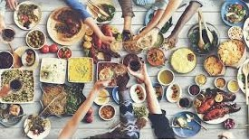

# So where do we eat?

<!--  -->

So where do we eat its a program that recommends you the best five restaurants based on your tastes and on your location. Also it's possible to receive this recommendations in your email.

## Instructions

Open your teminal and move to the desired location then clone this repository using the following command: `git clone https://github.com/jgph91/So-where-do-we-eat`   

In the terminal type python3 main.py 'City' 'Tag', you have all the available cities and tags in the following section.  
i.e: `python3 main.py Madrid Italian`

## Available options

These are the cities availables: Lyon, Paris, Barcelona, Geneva, Copenhagen, Zurich, Madrid, Brussels, Stockholm, Oslo, Warsaw, Lisbon, Rome, Luxembourg, Budapest, Amsterdam, Dublin, Ljubljana, Bratislava, London, Athens, Edinburgh, Krakow, Oporto, Milan, Prague, Helsinki, Berlin, Vienna, Hamburg and Munich.   

These are the tags availables: 'Cajun & Creole', 'Central European', 'Soups', 'Vegetarian Friendly', 'German', 'Central American', 'Eastern European', 'Halal', 'Persian', 'Mexican', 'Street Food', 'Steakhouse', 'Mediterranean', 'Malaysian', 'Japanese', 'Pizza', 'Austrian', 'Belgian', 'Mongolian', 'Romanian', 'Arabic', 'Israeli', 'Australian', 'Nepali', 'Norwegian', 'Asian', 'Cafe', 'Taiwanese', 'Czech', 'Pub', 'Peruvian', 'New Zealand', 'African', 'Brew Pub', 'Canadian', 'Pakistani', 'Scandinavian', 'Cambodian', 'Central Asian', 'Southwestern', 'Swiss', 'Caucasian', 'Vietnamese', 'Ukrainian', 'Afghani', 'Sushi', 'Spanish', 'Vegan Options', 'Barbecue', 'International', 'Bangladeshi', 'Seafood', 'Ethiopian', 'Kosher', 'Balti', 'Georgian', 'Hungarian', 'Scottish', 'Tibetan', 'Hawaiian', 'Singaporean', 'Armenian', 'Bar', 'Sri Lankan', 'South American', 'Grill', 'American', 'Argentinean', 'Indian', 'Caribbean', 'Korean', 'Croatian', 'Wine Bar', 'Ecuadorean', 'Healthy', 'Uzbek', 'Contemporary', 'Fusion', 'French', 'Polish', 'British', 'Colombian', 'Middle Eastern', 'Chinese', 'Delicatessen', 'Brazilian', 'Thai', 'Cuban', 'Gastropub', 'Salvadoran', 'Jamaican', 'Moroccan', 'Swedish', 'Greek', 'Indonesian', 'European', 'Portuguese', 'Venezuelan', 'Italian', 'Gluten Free Options', 'Dutch', 'Diner', 'Turkish', 'Fast Food', 'Latin', 'Russian', 'Filipino', 'Lebanese', 'Slovenian', 'Tunisian', 'Danish', 'Irish', 'Chilean'.

## Technologies

This program has been developed using Python, it uses argparse to receive the parameters city and tag from the terminal.
For cleaning the 'original dataset' <a href="https://www.kaggle.com/damienbeneschi/krakow-ta-restaurans-data-raw">original dataset</a> I used pandas, it also included in the iput folder of this repository.
The telephone numbers and the range of prices were got from the <a href="https://www.tripadvisor.com">TA web</a> using beautiful soup.
The pdf with all the data was created using the pfpf library.

## Program files

- `main.py` main script  
- `src/cleaning.py` returns the formated database  
- `src/functions.py` additional functions for cleaning the database  
- `src/web_scraping.py` web scraping fucntions for getting phones and range prices  
- `src/pdf.py` function for printing out the results in pdf  
- `src/mail.py` function for sending the pdf via mail  
- `input/TA_restaurants_curated.csv` csv file with the data from trip advisor  
- `output/Best_restaurants` pdf containing the results of your query in a table
- `requirements.txt` contain the required modules to execute this program  

## Contact info

If you have any doubt please don't heisitate to contact with me:

- email : jgph91@gmail.com
- linkedin:  <a href="https://www.linkedin.com/in/javier-gomez-del-pulgar/?locale=en_US">Javier Gómez del Pulgar</a>

